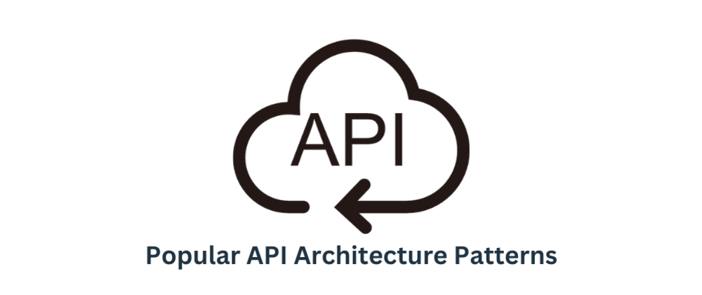
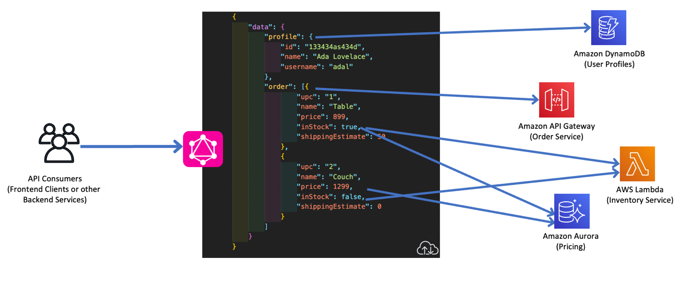
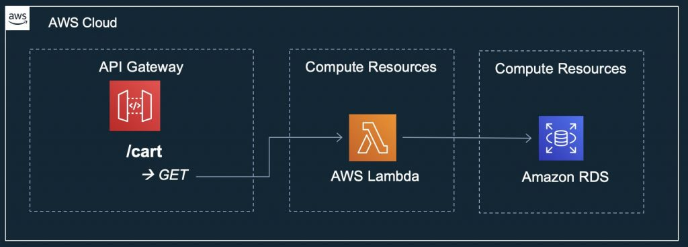
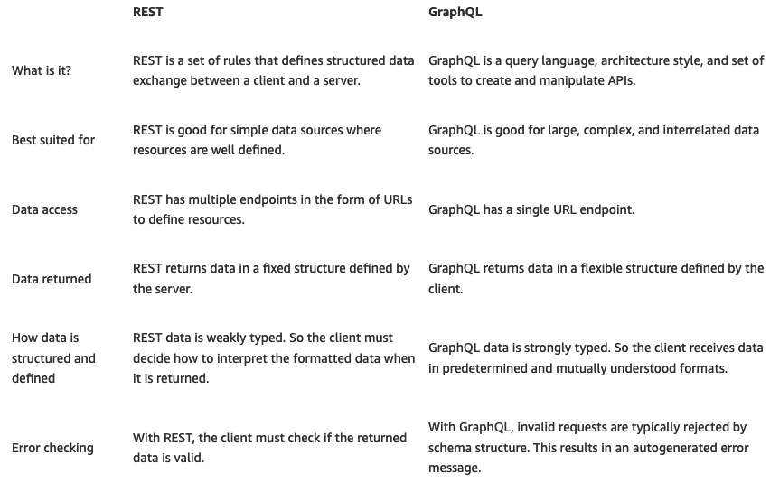

<div align = "center">
  <h1> API Architecture Patterns </h1>
</div>

<div align = "center">
  
</div>

<hr>

## Table of Contents

- [What is the Difference Between GraphQL and REST?](#what-is-the-difference-between-graphql-and-rest)
- [What are the similarities between GraphQL and REST?](#what-are-the-similarities-between-graphql-and-rest)
- [What REST limitations does GraphQL attempt to overcome?](#what-rest-limitations-does-graphql-attempt-to-overcome)
- [Key differences between GraphQL and REST](#key-differences-between-graphql-and-rest)
- [When to use GraphQL vs. REST](#when-to-use-graphql-vs-rest)
- [How to use both GraphQL and REST over the same API](#how-to-use-both-graphql-and-rest-over-the-same-api)
- [Summary of differences: REST vs GraphQL](#summary-of-differences-rest-vs-graphql)
- [How can AWS support your GraphQL and REST requirements?](#how-can-aws-support-your-graphql-and-rest-requirements)

Sources:

- [What’s the Difference Between GraphQL and REST?](https://aws.amazon.com/compare/the-difference-between-graphql-and-rest/)
- [Top 6 Most Popular API Architecture Styles You Need to Know (with Pros, Cons, and Use Cases) ](https://dev.to/kanani_nirav/top-6-most-popular-api-architecture-styles-you-need-to-know-with-pros-cons-and-use-cases-564j)

# What is the Difference Between GraphQL and REST?

GraphQL and REST are two distinct approaches to designing API for exchanging data over the internet. REST enables client applications to exchange data with a server using HTTP verbs, which is the standard communication protocol of the internet. On the other hand, GraphQL is an API query language that defines specifications of how a client application should request data from a remote server. You can use GraphQL in your API calls without relying on the server-side application to define the request. Both GraphQL and REST are powerful technologies behind most of our modern applications.

# What are the similarities between GraphQL and REST?

Both GraphQL and REST are popular API architecture styles that enable the exchange of data between different services or applications in a client-server model.

APIs facilitate the access of data and data operations like this:

    1. A client sends an API request to an endpoint or multiple endpoints on a server
    2. The server gives a response that contains data, data status, or error codes

REST and GraphQL allow you to create, modify, update, and delete data on a separate application, service, or module via API. APIs developed with REST are known as RESTful APIs or REST APIs. Those developed with GraphQL are simply GraphQL APIs.

Frontend and backend teams use these API architectures to create modular and accessible applications. Using an API architecture helps keep systems secure, modular, and scalable. It also makes systems more performant and easier to integrate with other systems.

### **Architecture**

Both REST and GraphQL implement several common API architectural principles. For example, here are principles they share:

    - Both are stateless, so the server does not save response history between requests
    - Both use a client-server model, so requests from a single client result in replies from a single server
    - Both are HTTP-based, as HTTP is the underlying communication protocol

### **Resource-based design**

REST and GraphQL both design their data interchange around resources. A resource refers to any data or object that the client can access and manipulate through the API. Each resource has its own unique identifier (URI) and a set of operations (HTTP methods) that the client can perform on it.

For example, consider a social media API where users create and manage posts. In a resource-based API, a post would be a resource. It has its own unique identifier, for example, /posts/1234. And it has a set of operations, such as GET to retrieve the post in REST or query to retrieve the post in GraphQL.

### **Data-exchange**

Both REST and GraphQL support similar data formats.

JSON is the most popular data exchange format that all languages, platforms, and systems understand. The server returns JSON data to the client. Other data formats are available but less commonly used, including XML and HTML.

Similarly, REST and GraphQL both support caching. So, clients and servers can cache frequently accessed data to increase speed of communication.

### **Language and database neutrality**

Both GraphQL and REST APIs work with any database structure and any programming language, both client-side and server-side. This makes them highly interoperable with any application.

# What REST limitations does GraphQL attempt to overcome?

GraphQL emerged in 2012 as a response to the need for speed in emerging social media platforms. Developers found that existing API architectures, like REST, were too lengthy and structured to produce news feeds efficiently.

Next, we discuss some of the challenges they faced.

### **Fixed-structure data exchange**

The REST API requires client requests to follow a fixed structure to receive a resource. This rigid structure is easy to use, but it’s not always the most efficient means to exchange exactly the data needed.

### **Overfetching and underfetching**

REST APIs always return a whole dataset. For example, from a person object in the REST API, you would receive the person’s name, date of birth, address, and phone number. You would get all of this data even if you only needed a phone number.

Similarly, if you wanted to know a person’s phone number and last purchase, you would need multiple REST API requests. The URL /person would return the phone number and the URL /purchase would return purchase history.

Social media developers had to write a lot of code just to process API requests, which affected performance and user experience.

GraphQL emerged as a query-based solution. Queries can return the exact data in only one API request and response exchange.

# Key differences between GraphQL and REST

A REST API is an architectural concept for application communication. On the other hand, GraphQL is a specification, an API query language, and a set of tools. GraphQL operates over a single endpoint using HTTP.

In addition, REST development has been more focused on making new APIs. Meanwhile, GraphQL’s focus has been on API performance and flexibility.

Next, we give some more differences.

### **Client-side request**

Here’s what a REST request uses to work:

    - HTTP verbs that determine the action
    - A URL that identifies the resource on which to action the HTTP verb
    - Parameters and values to parse, if you want to create or modify an object within an existing server-side resource

For example, you use GET to get read-only data from a resource, POST to add a new resource entry, or PUT to update a resource.

In contrast, here’s what GraphQL requests use:

    - Query for getting read-only data
    - Mutation for modifying data
    - Subscription to receive event-based or streaming data updates

A data format describes how you would like the server to return the data, including objects and fields that match the server-side schema. You can also input new data. Internally, GraphQL sends every client request as a POST HTTP request.

### **Data returned to the client**

Under REST architecture, data is returned to the client from the server in the whole-of-resource structure specified by the server. The following examples show returned data in REST and GraphQL.

#### Example of returned data in REST

In REST, GET /posts returns the following:

```json
[
  {
    "id": 1,

    "title": "First Post",

    "content": "This is the content of the first post."
  },

  {
    "id": 2,

    "title": "Second Post",

    "content": "This is the content of the second post."
  },

  {
    "id": 3,

    "title": "Third Post",

    "content": "This is the content of the third post."
  }
]
```

#### Example of returned data in GraphQL

When you use GraphQL, only the data specified in the structure given by the client is returned.

GET /graphql?query{post(id: 1) {id title content}} returns only the first post:

```json
{
  "data": {
    "posts": [
      {
        "id": "1",

        "title": "First Post",

        "content": "This is the content of the first post."
      }
    ]
  }
}
```

### Server-side schema

GraphQL uses a server-side schema to define data and data services, which differs from a REST API.

The schema, written in GraphQL schema definition language, includes details like these:

    - Object types and fields that belong to each object
    - Server-side resolver functions that define an operation for each field

The schema explicitly defines types to describe all data available on the system and how clients can access or modify that data.

On the other hand, REST APIs do not require a server-side schema. But you can define it optionally for efficient API design, documentation, and client development.

### Versioning

As APIs evolve, their data structures and operations may change. For clients without the knowledge of these changes, it can break their systems or introduce unknown errors.

REST APIs often include versioning in the URL to solve this issue, like https://example.com/api/v1/person/12341. However, versioning is not mandatory, and it can lead to errors.

GraphQL requires API backward compatibility. So deleted fields return an error message, or those with a deprecated tag return a warning.

### Error handling

GraphQL is a strongly typed API architecture, which means that it requires a detailed description of the data, its structure, and data operations in the schema. Due to the level of detail in the schema, the system can automatically identify request errors and provide useful error messages.

REST APIs are weakly typed, and you must build error handling into the surrounding code. For example, if a PUT request parses a number value as text instead of as an integer, the system does not identify the error automatically.

# When to use GraphQL vs. REST

You can use GraphQL and REST APIs interchangeably. However, there are some use cases where one or the other is a better fit.

For example, GraphQL is likely a better choice if you have these considerations:

    - You have limited bandwidth, and you want to minimize the number of requests and responses
    - You have multiple data sources, and you want to combine them at one endpoint
    - You have client requests that vary significantly, and you expect very different responses

<div align="center">
    
</div>

On the other hand, REST is is likely a better choice if you have these considerations:

    - You have smaller applications with less complex data
    - You have data and operations that all clients use similarly
    - You have no requirements for complex data querying

<div align="center">
    
</div>

It’s also possible to build a single application with both GraphQL APIs and REST APIs for different areas of functionality.

# How to use both GraphQL and REST over the same API

Upgrading a RESTful API to a GraphQL API is possible without performing a complete rewrite.

Here’s an outline of the process:

    - Understand the data model of the RESTful API. To do this, examine the shape of the data in each URL resource.
    - Write the GraphQL schema from the data model.
    - Determine which operations clients perform on the data and include them into the schema.
    - Build a resolver function in the server-side code for each field in the schema.
    - Create a GraphQL server with the resolvers and schema.

After this, clients can communicate with your API using either GraphQL or REST.

# Summary of differences: REST vs GraphQL

<div align="center" style="margin-bottom: 30px;">
    
</div>

# How can AWS support your GraphQL and REST requirements?

Amazon Web Services (AWS) helps you build and serve better managed APIs.

[AWS AppSync](https://aws.amazon.com/appsync/) creates serverless GraphQL and publish-subscribe (pub/sub) APIs. They simplify application development through a single endpoint to securely query, update, or publish data.

With AWS AppSync, you create APIs that allow clients to do the following:

    - Interact with multiple data sources like SQL, NoSQL, search data, REST endpoints, and microservices with a single network call
    - Automatically sync data between mobile and web applications and the cloud
    - Broadcast data from the backend to and between connected clients
    - Access Internet of Things (IoT) data to build real-time dashboards in a mobile or web application

Similarly, [Amazon API Gateway](https://aws.amazon.com/api-gateway/) is a fully managed service that makes it easy for you to create, publish, maintain, monitor, and secure APIs at any scale.

Here are ways you can benefit by using API Gateway:

    - Provide users with high-speed performance for both API requests and responses
    - Authorize access to your APIs
    - Run multiple versions of the same API simultaneously to quickly iterate, test, and release new versions
    - Monitor performance metrics and information about API calls, data latency, and error rates
